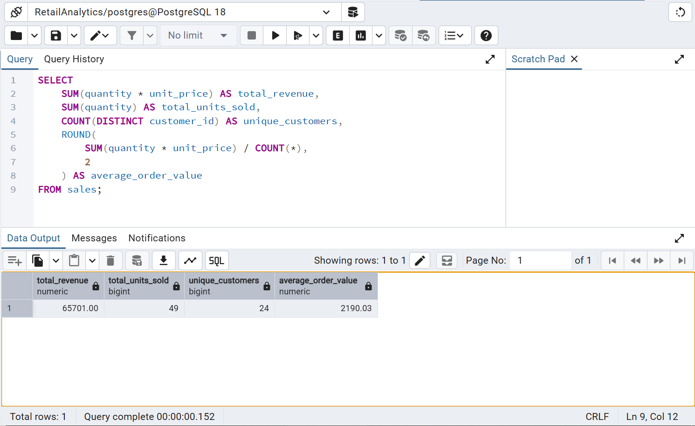
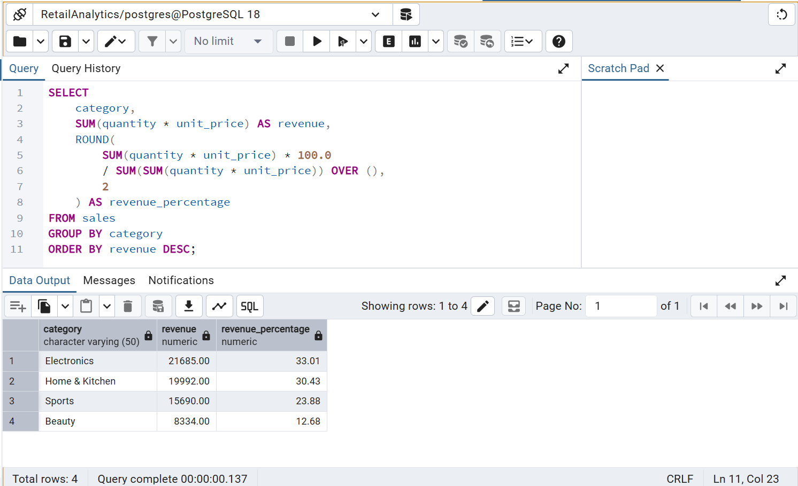
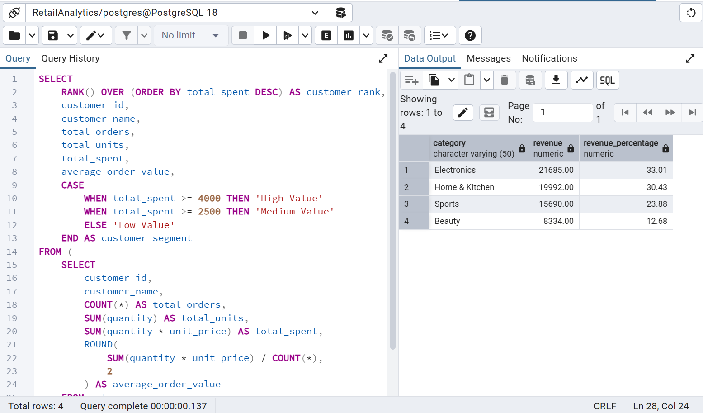

# Retail Sales & Customer Analytics — SQL

## 📊 Project Overview

This project analyzes retail sales data using PostgreSQL to uncover insights into revenue performance, customer behavior, product performance, payment methods, and sales trends.

The project demonstrates practical SQL skills used in real-world business analytics and portfolio projects.

## 🎯 Business Objectives

* Measure overall sales performance
* Identify top-performing categories and products
* Analyze customer purchasing behavior
* Identify repeat customers
* Segment customers based on spending
* Analyze monthly revenue trends
* Measure month-over-month revenue growth
* Compare revenue across cities
* Analyze payment method performance
* Perform data quality validation

## 🛠️ Tools & Technologies

* PostgreSQL 18
* pgAdmin
* SQL
* GitHub

## 📌 Key KPIs

| KPI                   |       Result |
| --------------------- | -----------: |
| Total Revenue         |      ₹65,701 |
| Total Units Sold      |           49 |
| Unique Customers      |           24 |
| Average Order Value   |    ₹2,190.03 |
| Repeat Customer Rate  |          25% |
| Top Revenue Category  |  Electronics |
| Top Revenue City      |         Pune |
| Highest Revenue Month | January 2026 |

## 🔍 Key Business Insights

### Category Performance

Electronics generated the highest revenue at **₹21,685**, contributing **33.01%** of total revenue.

Home & Kitchen generated **₹19,992**, followed by Sports at **₹15,690** and Beauty at **₹8,334**.

### Customer Behavior

The analysis identified **24 unique customers**, with **6 repeat customers**, resulting in a **25% repeat customer rate**.

Customers were segmented into High Value, Medium Value, and Low Value groups based on total spending.

### Sales Trend

January 2026 recorded the highest monthly revenue at **₹20,485**.

Monthly revenue changed as follows:

* February: **-29.27%**
* March: **+14.13%**
* April: **-14.19%**

### Geographic Performance

**Pune** generated the highest revenue among the analyzed cities, with **₹18,790**.

### Payment Methods

UPI generated the highest revenue at **₹32,775**, followed by Credit Card, Debit Card, and Cash.

## 🧠 SQL Skills Demonstrated

* SELECT
* WHERE
* GROUP BY
* ORDER BY
* Aggregate Functions
* COUNT()
* SUM()
* ROUND()
* DISTINCT
* HAVING
* CASE WHEN
* Common Table Expressions (CTEs)
* Window Functions
* RANK()
* LAG()
* Date Analysis
* Customer Segmentation
* Data Quality Checks
* Business KPI Analysis

## 📂 Project Structure

```text
retail-sales-customer-analytics-sql/
│
├── Retail_Sales_Customer_Analytics.sql
└── README.md
```

## 🧪 Data Quality

The project includes a dedicated data quality audit checking:

* Missing dates
* Missing customer IDs
* Missing customer names
* Invalid quantities
* Invalid prices
* Duplicate sale IDs

The sample dataset passed all validation checks.

## 💼 Portfolio Purpose

This project was created as a practical SQL portfolio project to demonstrate business analytics, data analysis, and PostgreSQL skills.

It demonstrates how SQL can be used to transform raw sales data into actionable business insights.

#

**Author:** Mahesh Borse <br> 
**Focus:** Data Analytics | SQL | Excel | Power BI

## 📊 Project Screenshots

### KPI Analysis


### Category Revenue Analysis


### Customer Analysis

